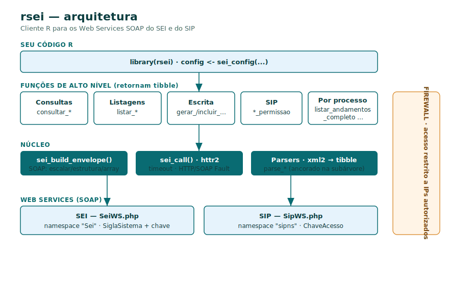
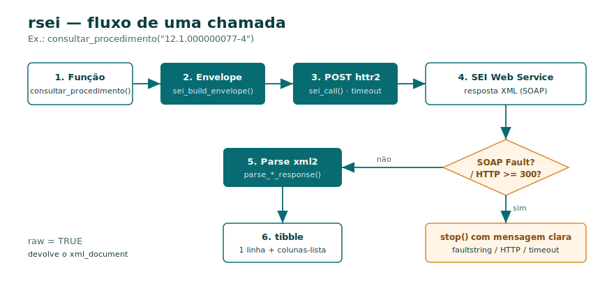

<!-- README.md is generated from README.Rmd. Please edit that file -->

```{r, include = FALSE}
knitr::opts_chunk$set(
  collapse = TRUE,
  comment = "#>",
  fig.path = "man/figures/README-",
  out.width = "100%"
)
```

# rsei (R + SEI) <a href="https://strategicprojects.github.io/rsei/"></a>

<!-- badges: start -->

[](https://github.com/StrategicProjects/rsei/actions/workflows/R-CMD-check.yaml)
[](https://github.com/StrategicProjects/rsei/actions/workflows/pkgdown.yaml)
<!-- badges: end -->

`rsei` é um toolkit em R para os Web Services SOAP do **SEI** (Sistema Eletrônico
de Informações). Ele monta os envelopes SOAP no formato esperado pelo SEI, executa
as chamadas com `httr2`, trata erros HTTP e *SOAP Fault*, e devolve os resultados
como `tibble`. Cobre consultas (`consultar_*`), listagens (`listar_*`), operações
de escrita (`gerar_procedimento`, `incluir_documento`, `enviar_processo`, ...) e
os serviços do **SIP** (`listar_permissao`, `replicar_permissao`, `replicar_usuario`).

> **⚠️ Acesso restrito por IP.** Os Web Services do SEI são protegidos por
> *firewall*: só respondem a requisições vindas de **IPs/servidores previamente
> autorizados** no cadastro do serviço no SEI. As funções deste pacote só
> retornarão dados quando executadas a partir de um host autorizado (por exemplo,
> o servidor institucional). A partir de um IP não autorizado as chamadas falham
> por *timeout* ou conexão recusada. A autenticação adicional é feita por
> `SiglaSistema` + chave de acesso (`IdentificacaoServico`).

## Arquitetura

Todas as operações são wrappers finos sobre um único motor SOAP
(`sei_build_envelope()` + `sei_call()`), com configuração centralizada
(`sei_config()`) e parsers que devolvem `tibble`.



O fluxo de uma chamada — da função ao `tibble`, com tratamento de erro:



## Instalação

```r
# install.packages("remotes")
remotes::install_github("StrategicProjects/rsei")
```

## Configuração

```r
library(rsei)

# Configuração reutilizada por todas as funções
cfg <- sei_config(
  sei_url               = "https://sei.pe.gov.br/sei/ws/SeiWS.php",
  sigla_sistema         = "HORTENSIAS",
  identificacao_servico = Sys.getenv("RSEI_IDENTIFICACAO_SERVICO")  # chave de acesso
)

# Opcional: definir como padrão da sessão (dispensa passar `config`)
sei_set_default_config(
  sigla_sistema         = "HORTENSIAS",
  identificacao_servico = Sys.getenv("RSEI_IDENTIFICACAO_SERVICO")
)
```

## Exemplo

```r
# Consultar um processo (retorna um tibble)
proc <- consultar_procedimento("0000000000.000001/2020-11", config = cfg)
proc$Especificacao
proc$Assuntos[[1]]          # coluna-lista com os assuntos

# Listar unidades, séries, tipos de processo, ...
unidades <- listar_unidades(cfg)
series   <- listar_series(cfg)
```

As operações de **escrita** alteram dados no SEI e devem ser validadas em
ambiente de homologação/treino antes de uso em produção.

---

`rsei` faz parte de um ecossistema de pacotes R desenvolvido na
[Secretaria Executiva de Monitoramento Estratégico](https://monitoramento.sepe.pe.gov.br).
```
